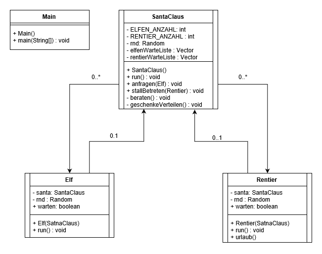

# Santa Claus

***NOTE:** This README and most of the comments in the code are in german*

## Aufgabenstellung
Santa Claus schläft, während seine Rentiere entweder Urlaub machen oder im Stall fressen, um für die Geschenklieferung entsprechende Kräfte zu sammeln. 
Fleißige Elfen basteln das ganze Jahr an Geschenken für die artigen Kinder. Manchmal stehen jedoch die Elfen vor unlösbaren Problemen, 
so dass sie Santa Claus‘ Rat in Anspruch nehmen müssen.

Um Santa Claus nicht ständig aufzuwecken und ihm den dringend benötigten Schlaf zu gewähren, gilt zwischen den Elfen und Santa Claus die Abmachung, 
dass die Elfen ihn erst wecken dürfen, wenn 3 oder mehr Elfen Hilfe benötigen. Wenn er von seinen Elfen geweckt wird, berät er mit ihnen 
aktuelle Probleme aus der Forschung & Entwicklungsabteilung, um anschließend Lösungsvorschläge zu erarbeiten. Anschließend legt er sich wieder schlafen.

Da Santa Claus die Kinder nicht allzu lange warten lassen möchte, lässt er sich ebenfalls wecken, 
wenn genug Rentiere bereit sind, um seinen 9 RS (Rentier-Stärken) Schlitten zu ziehen. Nach-dem die Spielzeuge ausgeliefert wurden und 
er zurück am Nordpol angelangt ist, macht er die Rentiere wieder los und entlässt sie in ihren wohlverdienten Urlaub. 
Er legt sich anschließend wieder schlafen.

Santa-Klaus gewährt seinen Rentieren den Vortritt, falls eine Gruppe Elfen und seine Rentiere gleichzeitig versuchen, ihn aufzuwecken.

 - Erstellen Sie ein OOD-Diagramm, das den geschilderten Sachverhalt hinreichend genau wie-dergibt. Unterscheiden Sie ausdrücklich zwischen aktiven und passiven Klassen. Das ge-schilderte Problem soll nur simuliert werden. Modellieren Sie beispielsweise eine Operation beraten() in der Klasse Santa_Claus, ohne eine konkrete Implementierung dafür an-zugeben.
 - Modellieren Sie das Verhalten eines Rentiers, das entweder im Stall eine gewisse Zeit frisst und sich ausruht oder eigenständig Urlaub macht, um anschließend Santa Claus zu helfen.
 - Implementieren Sie das Programm zur Simulation des Sachverhalts. Geben Sie über die Konsole (System.out.println()) entsprechende Meldungen aus.
 
 
## Diagramm

	

 